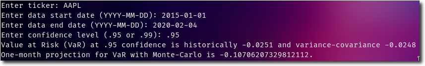
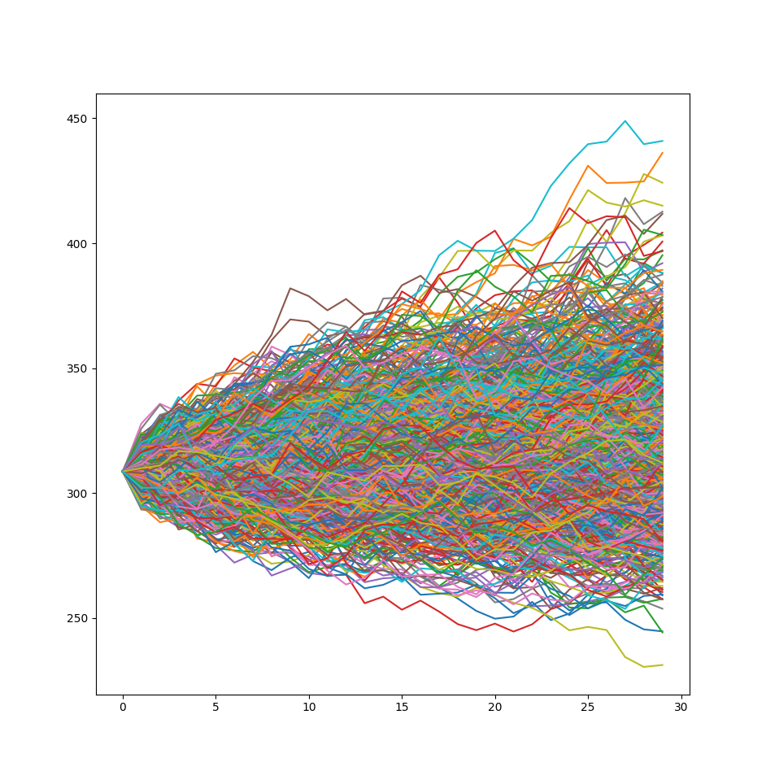

# Value at Risk (VaR) Model

This model calculates the Value at Risk (VaR) for a given equity through different methods. The VaR is returned as a percentage of portfolio value for a given equity. Any confidence level is accepted, though the most common are 95% or 99%.



For next-day VaR values, we can use the following methods:

1. Checking historical data
2. Generating percent change with the normal distribution (variance-covariance)

For future projections, we create a Monte-Carlo simulation for price values and return percent change from the last available time.

Data is sourced from `yfinance`, a Yahoo Finance scraper that returns prices from any specified date range.

## Calculating with Historical Data

VaR is calculated by simply checking the complementary percentile of the given confidence level from available historical data of percent returns per day.

```python
historicalValueAtRisk("AAPL", "2016-01-01", "2020-01-01", .95)
```

## Calculating with Variance-Covariance

VaR is calculated by finding the mean and standard deviation of the historical data range, then find the z-value of the normal distribution and calculating the VaR by adding the standard deviation multiplied by the z-value to the mean percent return (expected value).

```python
# TODO: Rename this function
getValueAtRisk("AAPL", "2016-01-01", .95)
```

## Projections with Monte-Carlo Simulations

For VaRs into the future, we first perform a Monte-Carlo simulation to generate a number of stock prices in the future through geometric Brownian motion.



We then find the VaR in a similar way compared to the historical method: take the last day's prices, calculate percent change, and find the cutoff for the complementary percentile of the given confidence level.

## Dependencies

* yfinance
* pandas
* numpy and scipy
* matplotlib
